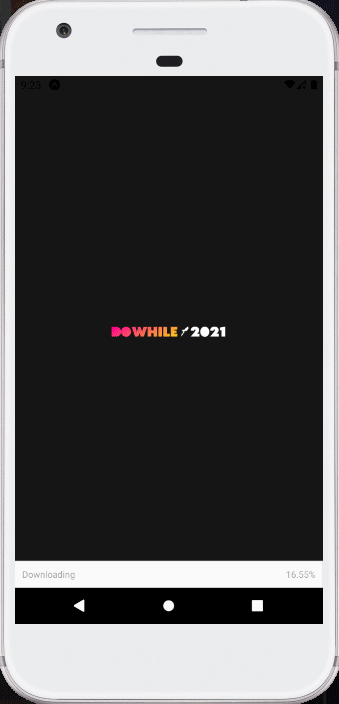
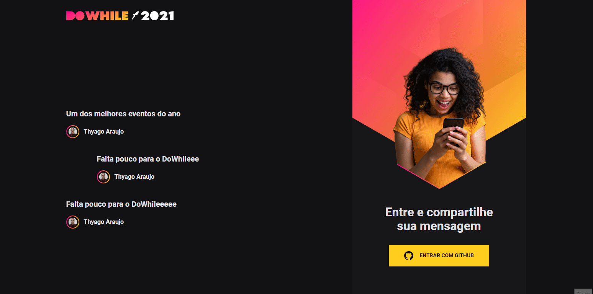

<h1 align="center">
      <a href="#" alt="Next-Level-Week-Heat"> Next Level Week Heat </a>
</h1>

<h3 align="center">
   Uma aplicação de login e autenticação com github para o envio e recebimento de mensagem em tempo real.
</h3>

  

  
  
  
   
  
 

<h4 align="center">
	🎉 Completo 🎉
</h4>

 <a href="#---sobre-o-repositório-">Sobre o projeto</a> •
 <a href="#--features"> Recursos </a> •
 <a href="#--Contributing"> Contribuição</a> •  
 <a href="#-autor">Autor</a>

---

<h2 id="---sobre-o-repositório-"> 💻  Sobre o repositório </h2>

Nesse projeto criado durante a Next Level Week Heat, criamos uma aplicação para nos conectarmos e mandarmos mensagens sobre nossas expectativas para o DoWhile 2021. A aplicação consiste de um Front-End feito com React, Mobile com React-Native e o Back-end com NodeJs e Prisma.
 
Na aplicação damos autorização para um serviço do github poder passar nossas informações do github para nossa aplicação, logando com nossa conta podemos mandar mensagens e o back-end registra essas mensagens com nossas informações do github e depois devolve a mensagem em tempo real. Tudo isso utilizando token de authenticação e autorização em tempo real.

---

<h2 align="center"> Projeto </h2>

<h4 align="center"> Mobile </h4>
  

   
  

<h4 align="center"> Web </h4>

  

---

<h2 id="--features"> Recursos </h2>

### Geral
- <a href="https://axios-http.com"> Axios </a>
- <a href="https://socket.io"> Socket IO </a>
- <a href="https://www.typescriptlang.org"> Typescript </a>

### Back-End
- <a href="https://nodejs.org" > NodeJs </a>
- <a href="https://www.prisma.io"> Prisma </a>
- <a href="expressjs.com"> Express </a>
- <a href="https://jwt.io"> JWT </a>

### Front-End
- <a href="https://reactjs.org">React </a>
- <a href="https://sass-lang.com"> SASS </a>
- <a href="https://vitejs.dev"> Vite </a>

### Mobile
- <a href="https://reactnative.dev"> React Native </a>
- <a href="https://expo.dev"> Expo </a>
- <a href="https://moti.fyi"> Moti </a>

---

<h2 id="--Contributing"> 🤝 Contribuindo </h2>

Este projeto é para fins de estudo, então me envie um e-mail me contando o que você está fazendo e por que está fazendo, me ensine o que você sabe

Todos os tipos de contribuições são muito bem-vindos e apreciados!

⭐️ Iniciar o projeto
 
🐛 Encontrar e relatar problemas
 
📥 Envie PRs para ajudar a resolver problemas ou adicionar recursos

---

<h2 id="-autor">Autor</h2>

<a href="https://github.com/thyagoaraujom">
 
 

 Thyago Araujo 

</a>

---

Feito com ❤️ por Thyago Araujo 👋🏽 [Entre em contato!](https://www.linkedin.com/in/thyago-araujo-m/)

---
